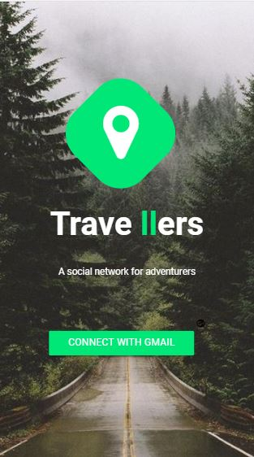
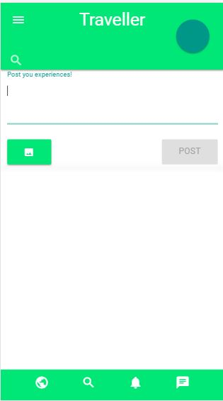
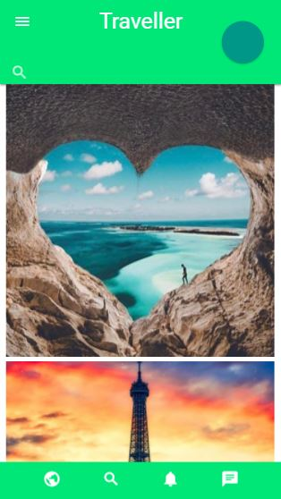

# Traveller 
  

* **Track:** _Common Core_
* **Curso:** _Crea tu propia red social_
* **Unidad:** _Crea tu propia red social_
* **Alumnas:**  
  * Elena Japa.  
  * Laura Velarde.  
  * Alexandra Calderón.  

***

En este reto, un emprendedor muy visionario nos ha encargado crear una red social. No nos da mucho detalle sobre qué tipo de red social quiere, él solo nos dice que creemos la que mejor podamos y que luego lo convenzamos de que nuestra red social será la más exitosa.

Para él hay algunos puntos básicos que debe tener una red social:

* Perfiles de usuarios.  
* Un newsfeed donde puedes ver las actualizaciones de todos tus contactos.  
* Un lugar donde poder escribir posts.  
* Un lugar para subir fotos.  
* Capacidad para poder tener amigos o para poder seguir a personas/marcas dentro de la red social.  
* Ser mobile friendly.  
* Etc.

Este emprendedor, además, sabe que los creadores de productos tienen que pensar siempre en los usuarios y espera que tengas en cuenta lo que necesitan los usuarios al momento de crear este producto, si piensas por ejemplo en una red social para compartir memes, o una para compartir cosas de mascotas o alguna otra para compartir tips sobre restaurantes o recetas, tendrás que tener en cuenta qué es lo que le gustaría encontrar a un usuario sobre estos temas en la red social.

Un ejemplo: a este emprendedor le presentaron un caso de una red social para químicos. En esta red social los químicos postean artículos sobre sus investigaciones y pueden encontrar el contenido de acuerdo a lo más popular, lo reciente o lo más comentado. Además, pueden comentar en los artículos de sus colegas y pueden filtrar artículos de acuerdo a determinadas etiquetas.

## Requerimientos 
* Trabajar en parejas.  
* Tener una planificación.  
* La definición del diseño.  
* Diseño mobile friendly.  
* Desplegar el producto en Github Pages.  
* Desarrollar un login o se desea almacenar la información en una base de datos, usar Firebase.  

## Objetivos del reto
* Aprender a **planificar**.
* Crear **plan** de acción.
* **Documentar** propuesta y plan de acción en el **README.md**.
* Encontrar una **problemática** a la que darle solución.
* **Prototipar** y **testear**.
* Sustentar tu propuesta y **recolectar feedback**.  
* Crear una **red social** viable.
* Aprender a usar **Firebase**.
* Implementar `gh.pages`. 
* Compartir la experiencia de aprendizaje.  

## Herramientas usadas

* HTML.  

* CSS.  

* Grid System.  

* Media Query.  

* Framework: 

* Jquery. 

* Firebase. 

## Rapid prototyping

Para crear la red social de nuestro cliente emprendedor, tuvimos varias ideas: 

* Red social de Gamers. 
* Red social de Programadores.  
* Red social de Voluntariado y Ayuda.
* Red social de Viajes y turismo. 

Luego de un pequeño debate, decidimos ir por dos de ellas, que nos parecían más viables por tener mayor problemática: 

* Red social de Voluntariado y Ayuda.
* Red social de Viajes y turismo. 

### Desarrollando las ideas

####  Red social de Voluntariado y Ayuda

######  Contacto
* **Nombre:** Kelly Chumbes Díaz. 
* **Ocupación:** Abogada, trabaja en el Ministerio de la Mujer y Poblaciones Vulnerables en la Oficina de Voluntariado. 
* **Edad:**  32.
* **Personalidad:** Práctica y Cursi. 

###### Preguntas 

1. ¿Cuándo fue la ultima vez que realizaste un trabajo de voluntariado?

2. ¿Qué tal te fue?

3. ¿Tuviste dificultades?  

4. ¿Quiénes conocen el trabajo que haces?  

5. ¿Tienes algún medio donde publicar tus acciones?  

6. ¿Te enteras de más grupos que realicen acciones parecidas? ¿Cuántas? 
 ¿Qué dificultades tienes para ayudar?  

###### Respuestas 

1. Mes de agosto, fui a hacer un levatamiento de zonas vulnerables afectadas por el Fenómeno del Niño Costero. Hice el estudio de los albergues en los que se encuentran las personas afectadas. Albergues les decimos(el grupo de trabajo en la oficina de voluntariado) a las carpas que se instalaron en cierto lugares para resguardar a las familias afectadas.  

2. Todo bien, normal. 

3. La dificultad fue llegar a los lugares en donde se encontraban exactamente como: Piura y Chosica.  

4. Mi trabajo lo conoce la dirección de voluntariado y por tanto el ministerio al que corresponde.  

5. Mis acciones son publicadas a nivel nacional, tanto como las de las asociaciones o grupos que nos ayudan.  

6. Sí nos enteramos, tenemos un registro de todos estos grupos de ayuda y voluntarios, estamos ya creando nuestra propia red de contacto. 

7. No tenemos dificultades para ayudar, tenemos los recursos necesarios tanto materiales, como humanitario. Este último lo obtenemos invitando a una o varias organizaciones vigentes en el registro. En este caso fue Alas Peruanas, a través de su oficina de desarrollo social, lo que hicimos en esa ocasión fue el limpiado de residuos solidos y entrega de algunos vivires, junto con la Municipalidad de cada ciudad, ellos brindaron las herramientas.  

###### Preguntas que surgieron
1. ¿Necesitan más personas? 
    *  No, tenemos suficiente. Además, nosotros no podemos convocar voluntarios, sino organizaciones o asociaciones de voluntarios.

##### Conclusiones

* Decidimos que esta primera opción no funcionaría porque ya se tenía un registro de las asociaciones y así pueden ser convocadas para eventos o algún caso en específico. 

####  Red social de Viajes 

######  Contacto
* **Nombre:** Oscar Chumbes Díaz. 
* **Ocupación:** Neonatólogo. Matrimonio feliz. 
* **Edad:**  42
* **Personalidad:** Práctico, aventurero, músico aficionado. 

###### Preguntas 
1. ¿Cuándo fue la ultima vez que viajaste??

2. ¿Sabías exactamente cómo sería tu viaje?

3. ¿Sabías de los pasajes y hospedaje? 

4. ¿Tenías conocidos? 

5. ¿Qué te sorprendió del viaje?

6. ¿Qué dificultades tuviste? 

7. ¿Compartiste tu experiencia? donde? cómo? con quiénes? 

8. ¿Te gustaría incentivar a otras personas a ir ? por qué?

###### Respuestas 

######  Contacto
* **Nombre:** Allison Chumbes Díaz. 
* **Ocupación:** Nutricionista, trabaja en el sector de minería. 
* **Edad:**  37. 
* **Personalidad:** Práctica y Cursi. 

###### Preguntas 
1. ¿Cuándo fue la ultima vez que viajaste??

2. ¿Sabías exactamente cómo sería tu viaje?

3. ¿Sabías de los pasajes y hospedaje? 

4. ¿Tenías conocidos? 

5. ¿Qué te sorprendió del viaje?

6. ¿Qué dificultades tuviste? 

7. ¿Compartiste tu experiencia? donde? cómo? con quiénes? 

8. ¿Te gustaría incentivar a otras personas a ir ? por qué?

###### Respuestas 

### Prototyping 

* **Tema**: Viajes.
* **Promáticas:** 
    
   * Dudas sobre pasajes, dónde comprarlos y exactamente a qué lugar. 
   * No saber cómo llegar a ciertos puntos del lugar visitado. 
   * Búsqueda de lugares para comer en Google lo que en realidad no garantiza que tan buena sea la comida.
   * Búsqueda de hospedaje en Google o preguntando a personas del lugar. Estos hospedajes a veces no terminan de satisfacer a los usuarios, incluso si se ha comprado paquetes de viaje.
   * Sentimiento de pérdida de experiencias. Puesto que, si compraron paquetes le dieron lugares específicos a donde ir y no fueron a otros lugares(les negaron la experiencia) y cuando viajan por sí solo no saben a donde ir y preguntan ahí mismo (un poco de pérdida de tiempo). 
   * Cuando las personas viajeras publican sus experiencias en red sociales muy usadas, se emocionan tanto y pueden incomodar a sus amigos. 
* **Propuesta de solución:**
  * Una red social de viajes, en la que los usuarios puedan postear imágenes de sus experiencias y dar tips. 
  
* **Búsqueda de soluciones parecidas a nuestra propuesta:**
  * Google Trips: 
    Aplicación que te ayuda a planear un viaje tiene zona de compra de pasajes, reservación de hospedaje, etc. Pero no un contacto de usuario-usuario en el que se pueda dar una interacción y compartir experiencias y consejos.

### Definición del diseño 

* **Nombre de la app**: Traveller.

* **Paleta de colores:** 
  Los colores se eligieron en base al significado psicológico de estos. 

  * Verde:  *rgb(0, 231, 119)* Inspira fuerza, salud, naturaleza y libertad.
  * Blanco: Creatividad. Inspira al juego, profundidad y paz.

  

* Branding: 
  1. Nombre: 
    Ya que el tema de la red social es viajes, pues al principio quisimos que fuera "Travel", pero en vista de que era muy general decidimos aumentar un "ler", que hacía que se viera y esuchara más profesional.
  
  2. Isotipo: 
    Se creó un logo en base al tono de verde escogido y un ícono que representara el concepto de nuestra red social. 

    

## Agenda

#### Día 1 

1. Leer el reto y priorizar sus requerimientos.(10min)
2. Creación de un plan: Estimación de tiempo/tareas. (10min)
3. Lluvia de ideas para elegir el tema en el que se basará nuestra red social. (7min)
4. Elegir las ideas en las que se crea encontrar problámaticas.(7min)
5. Planificar nuevamente cómo se llevarán a cabo las tareas para testear nuestros posibles temas. (10min)

#### Día 1 

1. Leer el reto y priorizar sus requerimientos.(10min)
2. Creación de un plan: Estimación de tiempo/tareas. (10min)
3. Lluvia de ideas para elegir el tema en el que se basará nuestra red social. (7min)
4. Elegir las ideas en las que se crea encontrar problámaticas.(7min)
5. Planificar nuevamente cómo se llevarán a cabo las tareas para testear nuestros posibles temas. (10min)

#### Día 2 

1. Testeo de posibles temas.(2h) 
2. Debatir entre nosotras el resultado (15min)
3. Encontrar la problemátca (10min)
4. Armar una solución al problema (10min)
5. Hacer el primer prototipado (7min) 

#### Día 3 

1. Testear el prototipo 1 (1h)
2. Modificar el primer prototipo según los resultados del testeo (15min )
3. Testear el segundo prototipo (30min)
4. Darle un nombre a nuestra solución (5min)
5. Crear paleta de colores de nuestra web-app.(12min)
6. Crear un logotipo propio (2h)
7. Revisar que todo quede en orden para empezar a codificar. 
8. División de tareas por vistas en la app (5min)

#### Día 4 

1. Mostrar lo avanzado (10min)
2. 
3. 
4. 
5. 

## Logro

